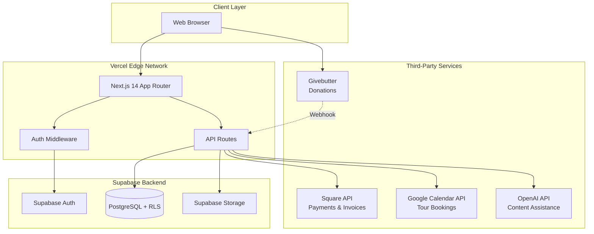
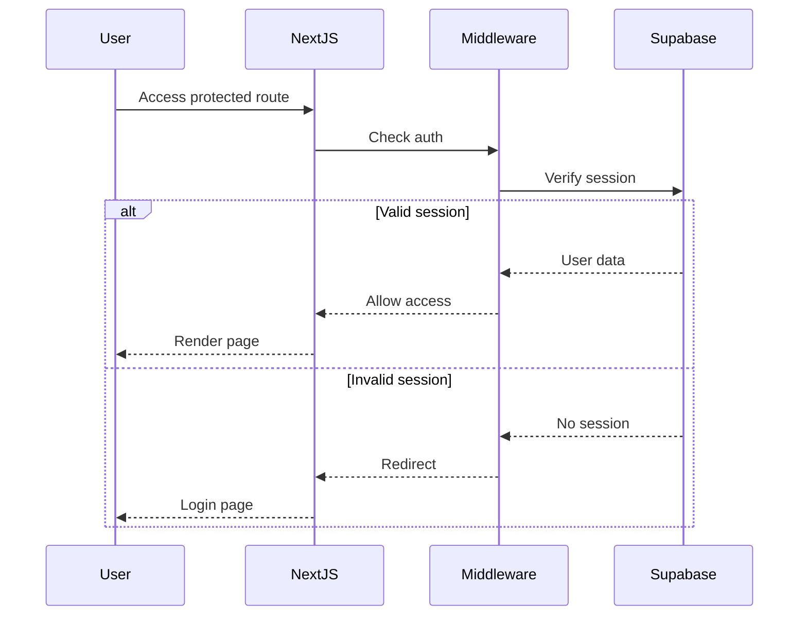

# Design Document

## Overview

The Sunrise School of Miami website and parent portal is a full-stack web application built on Next.js 14 with App Router, leveraging Supabase for backend services and integrating with multiple third-party platforms. The architecture follows a modern serverless approach with clear separation between public-facing content, authenticated parent portal features, and administrative functions.

### Key Design Principles

- **Security First**: Row-level security (RLS) policies, minimal PII storage, audit logging
- **Performance**: Static generation for public pages, incremental static regeneration (ISR) for dynamic content, edge caching
- **Accessibility**: WCAG 2.2 AA compliance throughout
- **Scalability**: Serverless architecture on Vercel, managed database on Supabase
- **Maintainability**: TypeScript for type safety, modular component architecture, clear API boundaries

## Architecture

### High-Level Architecture



### Technology Stack

**Frontend**
- Next.js 14 (App Router, React Server Components)
- TypeScript
- Tailwind CSS
- shadcn/ui component library
- React Hook Form + Zod for form validation
- TanStack Query for data fetching

**Backend**
- Supabase (PostgreSQL, Auth, Storage, Realtime)
- Next.js API Routes (serverless functions)
- Vercel Edge Functions for middleware

**Third-Party Integrations**
- Square Web Payments SDK & Invoices API
- Givebutter widget embed & webhooks
- Google Calendar API
- OpenAI API (optional)

**DevOps**
- Vercel for hosting and CI/CD
- GitHub for version control
- Supabase CLI for migrations

## Components and Interfaces

### Application Structure

```
app/
├── (public)/                 # Public-facing pages
│   ├── page.tsx             # Homepage
│   ├── about/
│   ├── curriculum/
│   ├── admissions/
│   ├── news-events/
│   ├── employment/
│   ├── give/
│   └── blog/
├── (auth)/                   # Authentication pages
│   ├── login/
│   ├── signup/
│   └── reset-password/
├── portal/                   # Parent portal (protected)
│   ├── layout.tsx
│   ├── dashboard/
│   ├── invoices/
│   ├── registrations/
│   ├── resources/
│   └── profile/
├── admin/                    # Admin dashboard (protected)
│   ├── layout.tsx
│   ├── dashboard/
│   ├── events/
│   ├── invoices/
│   ├── blog/
│   ├── resources/
│   ├── forms/
│   ├── crm/
│   └── settings/
└── api/                      # API routes
    ├── webhooks/
    │   ├── square/
    │   └── givebutter/
    ├── square/
    ├── google/
    └── openai/
```

### Core Components

**Layout Components**
- `Header`: Navigation, auth status, donate button
- `Footer`: Links, social media, newsletter signup
- `AnnouncementBar`: Dismissible site-wide announcements
- `CookieConsent`: GDPR/privacy compliance banner

**Public Components**
- `HeroSection`: Homepage hero with banners and CTAs
- `EventsRail`: Upcoming events with capacity indicators
- `EventCard`: Event preview with registration status
- `EventDetail`: Full event information with registration flow
- `BlogCard`: Blog post preview
- `BlogPost`: Full blog post with MDX rendering
- `TourBooking`: Google Calendar embed or native form
- `DonateButton`: Givebutter widget trigger

**Portal Components**
- `InvoiceList`: Family invoices with payment links
- `InvoiceDetail`: Invoice information and Square payment
- `RegistrationList`: Family event registrations
- `ResourceLibrary`: Categorized downloadable resources
- `FamilyProfile`: Editable family and student information

**Admin Components**
- `DashboardCards`: Metrics overview (invoices, capacity, tours, donations)
- `EventManager`: CRUD for events with roster export
- `InvoiceManager`: Square invoice creation and management
- `BlogEditor`: MDX editor with preview and scheduling
- `ResourceManager`: File upload and categorization
- `FormBuilder`: Drag-and-drop form creation
- `CRMDashboard`: Contact list with filters and segments
- `ContactDetail`: Full contact view with interaction history
- `AuditLogViewer`: Filterable audit trail

**Form Components**
- `DynamicForm`: Renders forms from schema with validation
- `FormField`: Reusable field component with error handling
- `FileUpload`: Drag-and-drop file upload to Supabase Storage

**Payment Components**
- `SquarePaymentForm`: Square Web Payments SDK integration
- `PaymentStatus`: Payment confirmation and error handling


### API Design

**Authentication & Authorization**
- Middleware checks Supabase session for protected routes
- RLS policies enforce data access at database level
- Role-based access control (admin, staff, parent)

**API Routes**

```typescript
// Webhooks
POST /api/webhooks/square          // Square payment notifications
POST /api/webhooks/givebutter      // Donation notifications

// Square Integration
POST /api/square/payment           // Process event registration payment
POST /api/square/invoices          // Create/update invoices
GET  /api/square/invoices/:id      // Get invoice details

// Google Calendar
POST /api/google/bookings          // Create tour booking
GET  /api/google/availability      // Check available time slots

// Events
GET  /api/events                   // List events (public)
POST /api/events                   // Create event (admin)
PUT  /api/events/:id               // Update event (admin)
DELETE /api/events/:id             // Delete event (admin)
POST /api/events/:id/register      // Register for event

// Forms
GET  /api/forms/:slug              // Get form schema
POST /api/forms/:slug/submit       // Submit form response
GET  /api/admin/forms              // List all forms (admin)
POST /api/admin/forms              // Create form (admin)

// CRM
GET  /api/crm/contacts             // List contacts with filters (admin)
GET  /api/crm/contacts/:id         // Get contact details (admin)
PUT  /api/crm/contacts/:id         // Update contact (admin)
POST /api/crm/contacts/:id/notes   // Add note to contact (admin)
GET  /api/crm/segments             // List saved segments (admin)
POST /api/crm/export               // Export contact list (admin)

// OpenAI (optional)
POST /api/ai/blog-draft            // Generate blog content
POST /api/ai/faq-answer            // Generate FAQ response
POST /api/ai/newsletter-summary    // Summarize newsletter
```

## Data Models

### Database Schema

**users**
```sql
CREATE TABLE users (
  id UUID PRIMARY KEY DEFAULT uuid_generate_v4(),
  email TEXT UNIQUE NOT NULL,
  name TEXT NOT NULL,
  role TEXT NOT NULL CHECK (role IN ('admin', 'staff', 'parent')),
  created_at TIMESTAMPTZ DEFAULT NOW(),
  updated_at TIMESTAMPTZ DEFAULT NOW()
);
```

**families**
```sql
CREATE TABLE families (
  id UUID PRIMARY KEY DEFAULT uuid_generate_v4(),
  primary_user_id UUID REFERENCES users(id) NOT NULL,
  secondary_user_id UUID REFERENCES users(id),
  address TEXT,
  phone TEXT,
  created_at TIMESTAMPTZ DEFAULT NOW(),
  updated_at TIMESTAMPTZ DEFAULT NOW()
);
```

**students**
```sql
CREATE TABLE students (
  id UUID PRIMARY KEY DEFAULT uuid_generate_v4(),
  family_id UUID REFERENCES families(id) ON DELETE CASCADE NOT NULL,
  name TEXT NOT NULL,
  dob DATE NOT NULL,
  grade TEXT,
  created_at TIMESTAMPTZ DEFAULT NOW(),
  updated_at TIMESTAMPTZ DEFAULT NOW()
);
```

**events**
```sql
CREATE TABLE events (
  id UUID PRIMARY KEY DEFAULT uuid_generate_v4(),
  title TEXT NOT NULL,
  slug TEXT UNIQUE NOT NULL,
  type TEXT NOT NULL,
  description TEXT,
  start_at TIMESTAMPTZ NOT NULL,
  end_at TIMESTAMPTZ NOT NULL,
  capacity INTEGER,
  price_cents INTEGER DEFAULT 0,
  image_url TEXT,
  is_published BOOLEAN DEFAULT false,
  created_by UUID REFERENCES users(id),
  created_at TIMESTAMPTZ DEFAULT NOW(),
  updated_at TIMESTAMPTZ DEFAULT NOW()
);
```

**registrations**
```sql
CREATE TABLE registrations (
  id UUID PRIMARY KEY DEFAULT uuid_generate_v4(),
  event_id UUID REFERENCES events(id) ON DELETE CASCADE NOT NULL,
  user_id UUID REFERENCES users(id) NOT NULL,
  student_id UUID REFERENCES students(id),
  qty INTEGER DEFAULT 1,
  total_cents INTEGER NOT NULL,
  status TEXT NOT NULL CHECK (status IN ('pending', 'paid', 'cancelled', 'waitlist')),
  square_payment_id TEXT,
  created_at TIMESTAMPTZ DEFAULT NOW(),
  updated_at TIMESTAMPTZ DEFAULT NOW()
);
```

**invoices**
```sql
CREATE TABLE invoices (
  id UUID PRIMARY KEY DEFAULT uuid_generate_v4(),
  square_invoice_id TEXT UNIQUE NOT NULL,
  family_id UUID REFERENCES families(id) NOT NULL,
  amount_cents INTEGER NOT NULL,
  status TEXT NOT NULL CHECK (status IN ('draft', 'sent', 'paid', 'cancelled')),
  due_at TIMESTAMPTZ NOT NULL,
  issued_at TIMESTAMPTZ,
  url TEXT,
  created_at TIMESTAMPTZ DEFAULT NOW(),
  updated_at TIMESTAMPTZ DEFAULT NOW()
);
```

**bookings**
```sql
CREATE TABLE bookings (
  id UUID PRIMARY KEY DEFAULT uuid_generate_v4(),
  calendar_id TEXT NOT NULL,
  google_event_id TEXT,
  booking_name TEXT NOT NULL,
  email TEXT NOT NULL,
  phone TEXT,
  start_at TIMESTAMPTZ NOT NULL,
  end_at TIMESTAMPTZ NOT NULL,
  status TEXT NOT NULL CHECK (status IN ('pending', 'confirmed', 'cancelled')),
  notes TEXT,
  created_at TIMESTAMPTZ DEFAULT NOW(),
  updated_at TIMESTAMPTZ DEFAULT NOW()
);
```

**donations**
```sql
CREATE TABLE donations (
  id UUID PRIMARY KEY DEFAULT uuid_generate_v4(),
  source TEXT NOT NULL CHECK (source IN ('givebutter')),
  external_id TEXT UNIQUE NOT NULL,
  amount_cents INTEGER NOT NULL,
  campaign TEXT,
  occurred_at TIMESTAMPTZ NOT NULL,
  created_at TIMESTAMPTZ DEFAULT NOW()
);
```

**blog_posts**
```sql
CREATE TABLE blog_posts (
  id UUID PRIMARY KEY DEFAULT uuid_generate_v4(),
  title TEXT NOT NULL,
  slug TEXT UNIQUE NOT NULL,
  excerpt TEXT,
  content TEXT NOT NULL,
  tags TEXT[] DEFAULT '{}',
  image_url TEXT,
  published_at TIMESTAMPTZ,
  created_by UUID REFERENCES users(id),
  created_at TIMESTAMPTZ DEFAULT NOW(),
  updated_at TIMESTAMPTZ DEFAULT NOW()
);
```

**parent_resources**
```sql
CREATE TABLE parent_resources (
  id UUID PRIMARY KEY DEFAULT uuid_generate_v4(),
  title TEXT NOT NULL,
  file_url TEXT NOT NULL,
  category TEXT NOT NULL,
  is_published BOOLEAN DEFAULT false,
  created_by UUID REFERENCES users(id),
  created_at TIMESTAMPTZ DEFAULT NOW(),
  updated_at TIMESTAMPTZ DEFAULT NOW()
);
```

**newsletter_signups**
```sql
CREATE TABLE newsletter_signups (
  id UUID PRIMARY KEY DEFAULT uuid_generate_v4(),
  email TEXT UNIQUE NOT NULL,
  consent_at TIMESTAMPTZ NOT NULL,
  status TEXT NOT NULL CHECK (status IN ('active', 'unsubscribed')),
  created_at TIMESTAMPTZ DEFAULT NOW()
);
```


**forms**
```sql
CREATE TABLE forms (
  id UUID PRIMARY KEY DEFAULT uuid_generate_v4(),
  title TEXT NOT NULL,
  slug TEXT UNIQUE NOT NULL,
  description TEXT,
  schema JSONB NOT NULL, -- Form field definitions
  is_active BOOLEAN DEFAULT true,
  created_by UUID REFERENCES users(id),
  created_at TIMESTAMPTZ DEFAULT NOW(),
  updated_at TIMESTAMPTZ DEFAULT NOW()
);
```

**form_submissions**
```sql
CREATE TABLE form_submissions (
  id UUID PRIMARY KEY DEFAULT uuid_generate_v4(),
  form_id UUID REFERENCES forms(id) ON DELETE CASCADE NOT NULL,
  data JSONB NOT NULL, -- Form response data
  contact_id UUID REFERENCES crm_contacts(id),
  submitted_at TIMESTAMPTZ DEFAULT NOW()
);
```

**crm_contacts**
```sql
CREATE TABLE crm_contacts (
  id UUID PRIMARY KEY DEFAULT uuid_generate_v4(),
  email TEXT UNIQUE NOT NULL,
  first_name TEXT,
  last_name TEXT,
  phone TEXT,
  status TEXT NOT NULL CHECK (status IN ('lead', 'prospect', 'enrolled', 'alumni')),
  source TEXT, -- e.g., 'website_form', 'tour_booking', 'referral'
  grade_interest TEXT,
  engagement_score INTEGER DEFAULT 0,
  tags TEXT[] DEFAULT '{}',
  opted_out BOOLEAN DEFAULT false,
  created_at TIMESTAMPTZ DEFAULT NOW(),
  updated_at TIMESTAMPTZ DEFAULT NOW()
);
```

**crm_interactions**
```sql
CREATE TABLE crm_interactions (
  id UUID PRIMARY KEY DEFAULT uuid_generate_v4(),
  contact_id UUID REFERENCES crm_contacts(id) ON DELETE CASCADE NOT NULL,
  type TEXT NOT NULL, -- 'form_submission', 'tour_booking', 'event_registration', 'email_open', 'page_visit'
  details JSONB,
  occurred_at TIMESTAMPTZ DEFAULT NOW()
);
```

**crm_notes**
```sql
CREATE TABLE crm_notes (
  id UUID PRIMARY KEY DEFAULT uuid_generate_v4(),
  contact_id UUID REFERENCES crm_contacts(id) ON DELETE CASCADE NOT NULL,
  note TEXT NOT NULL,
  created_by UUID REFERENCES users(id),
  created_at TIMESTAMPTZ DEFAULT NOW()
);
```

**crm_segments**
```sql
CREATE TABLE crm_segments (
  id UUID PRIMARY KEY DEFAULT uuid_generate_v4(),
  name TEXT NOT NULL,
  criteria JSONB NOT NULL, -- Filter criteria
  created_by UUID REFERENCES users(id),
  created_at TIMESTAMPTZ DEFAULT NOW(),
  updated_at TIMESTAMPTZ DEFAULT NOW()
);
```

**audit_logs**
```sql
CREATE TABLE audit_logs (
  id UUID PRIMARY KEY DEFAULT uuid_generate_v4(),
  actor_id UUID REFERENCES users(id),
  action TEXT NOT NULL,
  target_table TEXT NOT NULL,
  target_id UUID,
  changes JSONB,
  created_at TIMESTAMPTZ DEFAULT NOW()
);
```

### Row-Level Security (RLS) Policies

**Key RLS Patterns**

1. **Public Read Access**: Events, blog posts (published only)
2. **Family Data Isolation**: Parents can only access their own family's data
3. **Admin Full Access**: Admins and staff can access all data
4. **Audit Trail**: All sensitive operations logged

**Example RLS Policies**

```sql
-- Parents can only view their own family's invoices
CREATE POLICY "Parents view own invoices"
ON invoices FOR SELECT
USING (
  family_id IN (
    SELECT id FROM families 
    WHERE primary_user_id = auth.uid() 
    OR secondary_user_id = auth.uid()
  )
);

-- Admins can view all invoices
CREATE POLICY "Admins view all invoices"
ON invoices FOR SELECT
USING (
  EXISTS (
    SELECT 1 FROM users 
    WHERE id = auth.uid() 
    AND role IN ('admin', 'staff')
  )
);

-- Public can view published events
CREATE POLICY "Public view published events"
ON events FOR SELECT
USING (is_published = true);

-- Only admins can create/update events
CREATE POLICY "Admins manage events"
ON events FOR ALL
USING (
  EXISTS (
    SELECT 1 FROM users 
    WHERE id = auth.uid() 
    AND role IN ('admin', 'staff')
  )
);
```

## Error Handling

### Error Handling Strategy

**Client-Side**
- Form validation with Zod schemas
- User-friendly error messages
- Toast notifications for async operations
- Error boundaries for component failures

**Server-Side**
- Structured error responses with status codes
- Logging to Vercel/Supabase logs
- Graceful degradation for third-party service failures
- Retry logic for transient failures

**Error Types**

```typescript
type APIError = {
  code: string;
  message: string;
  details?: Record<string, any>;
};

// Example error codes
const ErrorCodes = {
  UNAUTHORIZED: 'UNAUTHORIZED',
  FORBIDDEN: 'FORBIDDEN',
  NOT_FOUND: 'NOT_FOUND',
  VALIDATION_ERROR: 'VALIDATION_ERROR',
  PAYMENT_FAILED: 'PAYMENT_FAILED',
  EXTERNAL_SERVICE_ERROR: 'EXTERNAL_SERVICE_ERROR',
  CAPACITY_EXCEEDED: 'CAPACITY_EXCEEDED',
};
```

**Third-Party Service Fallbacks**

- Square payment failures: Display error, allow retry, provide support contact
- Givebutter unavailable: Show alternative donation instructions
- Google Calendar API errors: Fall back to contact form
- OpenAI timeout: Disable AI features gracefully

## Testing Strategy

### Testing Approach

**Unit Tests**
- Utility functions and helpers
- Form validation schemas
- Data transformation logic
- Component logic (not UI)

**Integration Tests**
- API routes with mocked Supabase
- Authentication flows
- Payment processing (Square test mode)
- Webhook handlers

**End-to-End Tests**
- Critical user flows (registration, payment, login)
- Admin workflows (event creation, invoice management)
- Form submissions and CRM contact creation

**Accessibility Tests**
- Automated a11y testing with axe-core
- Keyboard navigation testing
- Screen reader compatibility

### Testing Tools

- **Jest**: Unit and integration tests
- **React Testing Library**: Component testing
- **Playwright**: E2E tests
- **axe-core**: Accessibility testing
- **MSW**: API mocking

### Test Coverage Goals

- 80%+ coverage for utility functions and API routes
- 100% coverage for payment and authentication logic
- E2E tests for all critical user journeys


## Security Implementation

### Authentication Flow



### Security Measures

**Authentication & Authorization**
- Supabase Auth with email/password
- JWT-based sessions with refresh tokens
- Role-based access control (RBAC)
- RLS policies at database level

**Data Protection**
- HTTPS only (enforced by Vercel)
- Encrypted data at rest (Supabase)
- Minimal PII storage
- Secure file uploads with signed URLs

**API Security**
- CSRF protection via SameSite cookies
- Rate limiting on API routes
- Input validation with Zod
- SQL injection prevention via Supabase client

**Third-Party Integration Security**
- API keys stored in environment variables
- Webhook signature verification (Square, Givebutter)
- OAuth 2.0 for Google Calendar
- Scoped API permissions

**Compliance**
- FERPA: Audit logs for student data access
- WCAG 2.2 AA: Accessibility compliance
- Cookie consent for third-party services
- Content Security Policy headers

### Audit Logging

All sensitive operations are logged:
- User authentication events
- Student/family data modifications
- Invoice creation and payments
- Resource access
- Admin actions

```typescript
async function createAuditLog(
  actorId: string,
  action: string,
  targetTable: string,
  targetId: string,
  changes?: Record<string, any>
) {
  await supabase.from('audit_logs').insert({
    actor_id: actorId,
    action,
    target_table: targetTable,
    target_id: targetId,
    changes,
  });
}
```

## Performance Optimization

### Rendering Strategy

**Static Generation (SSG)**
- About, Curriculum, Admissions pages
- Blog posts (ISR with revalidation)
- Public event listings (ISR)

**Server-Side Rendering (SSR)**
- Parent portal pages (personalized data)
- Admin dashboard (real-time metrics)
- Event detail pages (capacity updates)

**Client-Side Rendering (CSR)**
- Interactive forms
- Real-time updates (event capacity)
- Admin CRUD interfaces

### Caching Strategy

- **Edge Caching**: Static pages cached at CDN
- **ISR**: Revalidate blog posts and events every 60 seconds
- **API Caching**: Cache public API responses with stale-while-revalidate
- **Client Caching**: TanStack Query for data fetching with smart cache invalidation

### Image Optimization

- Next.js Image component for automatic optimization
- Responsive images with srcset
- WebP format with fallbacks
- Lazy loading for below-the-fold images

### Database Optimization

- Indexes on frequently queried columns (email, slug, status, dates)
- Materialized views for complex queries (engagement scores)
- Connection pooling via Supabase
- Query optimization with EXPLAIN ANALYZE

## Third-Party Integration Details

### Square Integration

**Web Payments SDK**
```typescript
const payments = Square.payments(applicationId, locationId);
const card = await payments.card();
await card.attach('#card-container');

const result = await card.tokenize();
if (result.status === 'OK') {
  // Send token to backend
  await fetch('/api/square/payment', {
    method: 'POST',
    body: JSON.stringify({
      sourceId: result.token,
      amount: totalCents,
      registrationId,
    }),
  });
}
```

**Invoices API**
- Create invoices via Square API
- Store square_invoice_id in database
- Provide hosted invoice URL to parents
- Webhook updates invoice status on payment

### Givebutter Integration

**Widget Embed**
```html
<script src="https://js.givebutter.com/elements/latest.js"></script>
<givebutter-widget campaign-id="CAMPAIGN_ID"></givebutter-widget>
```

**Webhook Handler**
```typescript
// POST /api/webhooks/givebutter
export async function POST(req: Request) {
  const payload = await req.json();
  
  // Verify webhook signature
  const isValid = verifyGivebutterSignature(payload, req.headers);
  if (!isValid) return new Response('Unauthorized', { status: 401 });
  
  // Store donation record
  await supabase.from('donations').insert({
    source: 'givebutter',
    external_id: payload.id,
    amount_cents: payload.amount,
    campaign: payload.campaign,
    occurred_at: payload.created_at,
  });
  
  return new Response('OK');
}
```

### Google Calendar Integration

**Appointment Page Embed**
```html
<iframe 
  src="https://calendar.google.com/calendar/appointments/schedules/..."
  width="100%" 
  height="600"
></iframe>
```

**Native Booking (Optional)**
```typescript
import { google } from 'googleapis';

const calendar = google.calendar({ version: 'v3', auth: oauth2Client });

await calendar.events.insert({
  calendarId: 'primary',
  requestBody: {
    summary: `Tour - ${bookingName}`,
    start: { dateTime: startAt },
    end: { dateTime: endAt },
    attendees: [{ email }],
  },
});
```

### OpenAI Integration (Optional)

```typescript
import OpenAI from 'openai';

const openai = new OpenAI({ apiKey: process.env.OPENAI_API_KEY });

async function generateBlogDraft(topic: string) {
  const completion = await openai.chat.completions.create({
    model: 'gpt-4',
    messages: [
      { role: 'system', content: 'You are a school communications expert.' },
      { role: 'user', content: `Draft a blog post about: ${topic}` },
    ],
  });
  
  return completion.choices[0].message.content;
}
```

## Deployment Architecture

### Vercel Configuration

```json
{
  "buildCommand": "npm run build",
  "outputDirectory": ".next",
  "framework": "nextjs",
  "env": {
    "NEXT_PUBLIC_SUPABASE_URL": "@supabase-url",
    "NEXT_PUBLIC_SUPABASE_ANON_KEY": "@supabase-anon-key",
    "SUPABASE_SERVICE_ROLE_KEY": "@supabase-service-key",
    "SQUARE_APPLICATION_ID": "@square-app-id",
    "SQUARE_ACCESS_TOKEN": "@square-access-token",
    "GOOGLE_CLIENT_ID": "@google-client-id",
    "GOOGLE_CLIENT_SECRET": "@google-client-secret",
    "GIVEBUTTER_WEBHOOK_SECRET": "@givebutter-webhook-secret",
    "OPENAI_API_KEY": "@openai-api-key"
  }
}
```

### Database Migrations

Supabase migrations managed via CLI:

```bash
# Create migration
supabase migration new create_tables

# Apply migrations
supabase db push

# Generate TypeScript types
supabase gen types typescript --local > types/supabase.ts
```

### CI/CD Pipeline

1. **Push to GitHub**: Trigger Vercel build
2. **Build**: Next.js production build
3. **Test**: Run unit and integration tests
4. **Deploy**: Deploy to Vercel edge network
5. **Migrations**: Apply database migrations (manual approval for production)

## Content Migration Strategy

### WordPress to Next.js Migration

**Content Extraction**
1. Export WordPress content via WP REST API or WP-CLI
2. Transform to Markdown/MDX format
3. Store in Git repository or Supabase

**Migration Script**
```typescript
// scripts/migrate-wordpress.ts
async function migrateContent() {
  // Fetch WordPress posts
  const posts = await fetchWordPressPosts();
  
  // Transform to blog_posts format
  for (const post of posts) {
    await supabase.from('blog_posts').insert({
      title: post.title.rendered,
      slug: post.slug,
      content: convertToMDX(post.content.rendered),
      published_at: post.date,
    });
  }
  
  // Migrate pages (About, Curriculum, etc.)
  const pages = await fetchWordPressPages();
  // Store as MDX files in app/(public)/
}
```

**Media Migration**
- Download images from WordPress
- Upload to Supabase Storage
- Update image URLs in content

## Monitoring and Analytics

### Application Monitoring

- **Vercel Analytics**: Page views, performance metrics
- **Supabase Logs**: Database queries, auth events
- **Error Tracking**: Sentry or similar for error monitoring
- **Uptime Monitoring**: Vercel or third-party service

### Business Metrics

- Event registration conversion rates
- Invoice payment rates
- Tour booking completion rates
- CRM engagement scores
- Donation amounts and frequency

### Performance Metrics

- Core Web Vitals (LCP, FID, CLS)
- Time to First Byte (TTFB)
- API response times
- Database query performance
